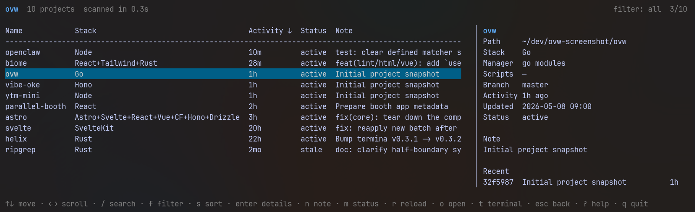

# ovw

A terminal overview for your local projects.

`ovw` scans the project folders you choose and shows what each project is, how
active it is, and where you may want to jump back in. Your folders and Git
history stay the source of truth.



`ovw` helps answer:

```txt
What projects do I have?
What are they built with?
What changed recently?
What needs attention?
```

## Install

Homebrew:

```sh
brew tap roie/tap
brew install ovw
```

macOS and Linux:

```sh
curl -fsSL https://raw.githubusercontent.com/roie/ovw/main/install.sh | sh
```

Windows:

```powershell
powershell -c "irm https://raw.githubusercontent.com/roie/ovw/main/install.ps1 | iex"
```

From source:

```sh
git clone https://github.com/roie/ovw
cd ovw
go install .
```

Prefer manual install? Download a prebuilt binary from
[releases](https://github.com/roie/ovw/releases).

## Quick Start

```sh
ovw
ovw --help
ovw --version
```

Use plain or JSON output:

```sh
ovw --plain
ovw --json
ovw vibe-oke
ovw parallel-booth --json
ovw vibe-oke --open
ovw .                       # temporary view for the current folder
```

## TUI

```txt
up/down or j/k     move
left/right or h/l  scroll columns
/                  search
f                  filter
s                  sort
c                  columns
ctrl+p             command palette
enter              details
n                  note
m                  status
p                  pin
a                  add
r                  runner
ctrl+r or F5       reload
o                  open
t                  terminal
?                  help
q                  quit
```

## Commands

```sh
ovw add <path>               # add project path
ovw hide <name-or-path>      # hide project
ovw unhide <name-or-path>    # show hidden project
ovw --hidden                 # list hidden projects

ovw set <name> --status active
ovw set <name> --note "fix check-in flow"
ovw set <name> --pin
ovw set <name> --script run="go run ."
ovw unset <name> --status
ovw unset <name> --note
ovw unset <name> --pin
ovw unset <name> --script run

ovw --status active          # filter by status
ovw --path ~/dev/web         # filter by project path
ovw --dirty                  # filter dirty projects
ovw --stale                  # filter stale projects
ovw --untagged               # filter projects without status
ovw --sort name:asc          # sort by name
ovw --sort updated:desc      # sort by exact updated time
ovw --sort activity:desc     # sort by activity

ovw config path              # print config path
ovw config edit              # edit config
ovw config setup             # choose project folders again
ovw config reset             # reset config and run setup next time
```

## Config And Data

The table columns follow your config:

```toml
columns = ["name", "stack", "activity", "status", "note"]
```

Available columns:

```toml
columns = ["name", "path", "stack", "manager", "scripts", "version", "ports", "branch", "updated", "activity", "status", "note"]
```

In the TUI, `c` lets you show, hide, and reorder columns without editing the
config file.

Project action shortcuts can be changed in Settings -> Keyboard shortcuts, or
directly in the config file:

```toml
[keys.actions]
details = "d"
terminal = "enter"
```

The table keeps configured columns stable. The side pane and details view hide
empty rows so only available project details are shown.

`ovw` stores user metadata only: hidden projects, status, notes, and pins.
Detected project details such as stack, manager, scripts, version,
descriptions, Git activity, recent commits, and recent files are read live from
your local files and Git history. The optional `ports` column inspects running
local processes and is only scanned when enabled.

Hiding a project never deletes files.

## Uninstall

Homebrew:

```sh
brew uninstall ovw
brew untap roie/tap
```

Remove the binary installed by curl:

```sh
rm ~/.local/bin/ovw
```

Remove the binary installed from source:

```sh
rm "$(go env GOPATH)/bin/ovw"
```

Remove config and user data:

```sh
rm -rf ~/.config/ovw
rm -rf ~/.local/share/ovw
```

On Windows, remove:

```txt
%LocalAppData%\ovw\bin\ovw.exe
%LocalAppData%\ovw
%AppData%\ovw
```

## Development

```sh
go run .
go test ./...
go build ./...
go run ./tools/bump-version <version>
```

## License

[MIT](LICENSE)
